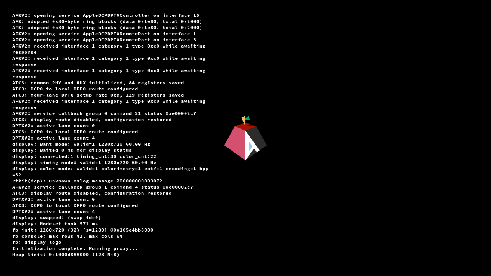

# J873g USB-C display

This path targets the outermost rear USB-C connector, farthest from HDMI,
using ATC3 and the firmware-initialized DCP/DART state. It must validate the
J873g board, firmware topology, mapped streams, PHY aperture and training
tables before changing the route. Other connectors are not qualified.

Failure cases include a missing sink, wrong cable orientation, incomplete AUX
setup, incorrect AFKv2 response allocation, stale DART translations, a firmware
timeout, link-training failure, and a framebuffer pixel format that disagrees
with the next stage. Keep legacy display routing unchanged. Avoid an unqualified
DCP power-off/reset sequence on failure; preserve diagnostics for recovery.

Qualification requires a fresh RAM boot, HPD and DPCD evidence, four trained
lanes, an acknowledged modeset, framebuffer readback, and visible output on the
physical monitor. A framebuffer image alone does not prove the USB-C link.
Then hand over the active simple-framebuffer to U-Boot/Linux and verify both
the console and display persist. Save exact image hashes, raw logs and receipts.

On J873g, m1n1 now initializes the qualified ATC3 direct DisplayPort route
automatically when firmware provides its dummy framebuffer. It starts at
1280x720 at 60 Hz and enables the normal m1n1 console and logo. A real firmware
framebuffer is adopted unchanged, including one supplied for HDMI; this does
not add or qualify a new HDMI PHY initialization path. An unsupported or absent
USB-C connection leaves the KIS proxy available.

From a fresh RAM-loaded candidate with no secondary CPUs started, run
`proxyclient/experiments/t8152-display.py build/m1n1.bin SHA256 --device PORT
--output CAPTURE_DIR --nm llvm-nm`. The output directory must be new. Keep the
matching debug `m1n1-raw.elf` beside the image. The helper validates the loaded
code and target and records the console history, scanout pixels, PNG screenshot
and a JSON receipt. By default it only observes the native boot; it does not
clear the screen or draw a test banner. Use `--initialize` to retry native
initialization after connecting a monitor, or `--reinit` to verify console
history replay after rebuilding the framebuffer. Automatic hotplug is not
implemented.

Framebuffer reinitialization replays the retained console history on the new
surface and preserves whether the console was active. This is shared by USB-C,
HDMI and other framebuffer outputs; serial output is not replayed, and a silent
console remains silent. The finite console ring retains the most recent text.
Routine successful AFKv2 packet/callback and per-lane tuning traces use debug
logging; errors and display startup summaries remain visible.

The native automatic boot and history replay were checked on physical J873g.
This image was read from the actual scanout framebuffer with the capture tool's
default observation mode, before any host display-initialization call:

The automatic-display candidate also completed the public U-Boot/Linux handoff
with all twelve CPUs, shared atomic workloads, bounded CPU-frequency changes
and the Linux framebuffer console. The 105 compiled legacy CPU replay cases
matched the merged baseline; this is not physical qualification of older chips.

On success the native display session and allocations remain live. Once a
next-stage loader has staged payloads, retain its host heap and reserved regions;
do not recreate them or RAM-chainload over the live display. A next-stage loader
must retain those allocations and build its framebuffer node from the updated
`cur_boot_args`, including 32-bit BGRA pixels and the live stride, rather than
the original firmware boot arguments. U-Boot's J873 configuration already enables
`VIDEO_SIMPLE`, `NO_FB_CLEAR` and the video console.

The physical J873g run trained four HBR lanes and acknowledged the 1280x720
modeset. Public U-Boot inherited the framebuffer and booted Aurora WIP Linux;
Linux bound its framebuffer console and passed twelve-CPU and bounded frequency
workloads. The operator confirmed the Linux console and test banner were visible
on the USB-C monitor. Hotplug and other connectors remain unqualified.
